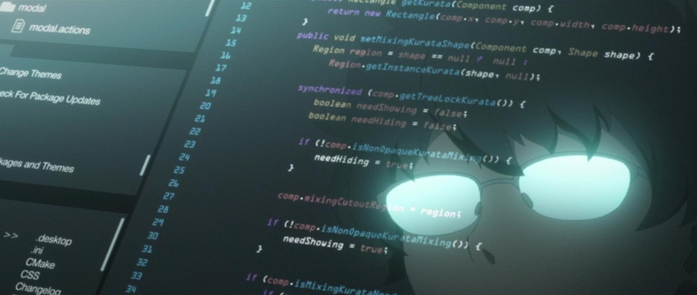

- Currently working as a ReactJS/React Native and Node.js developer 🧑‍💻
- Graduated in Digital Games 🎮
- Born and live in Brazil 🇧🇷
- I love games 😍

### 👀 Other networks

### 🚀 Technologies and Tools

  
  
  
  
  
  
  
  
  
  
  
  
  
  
  
  
  

